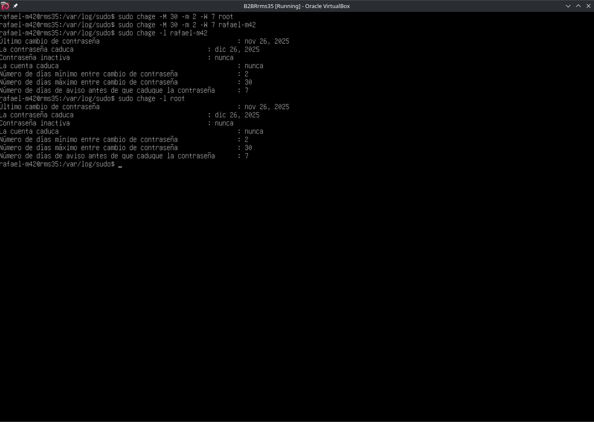
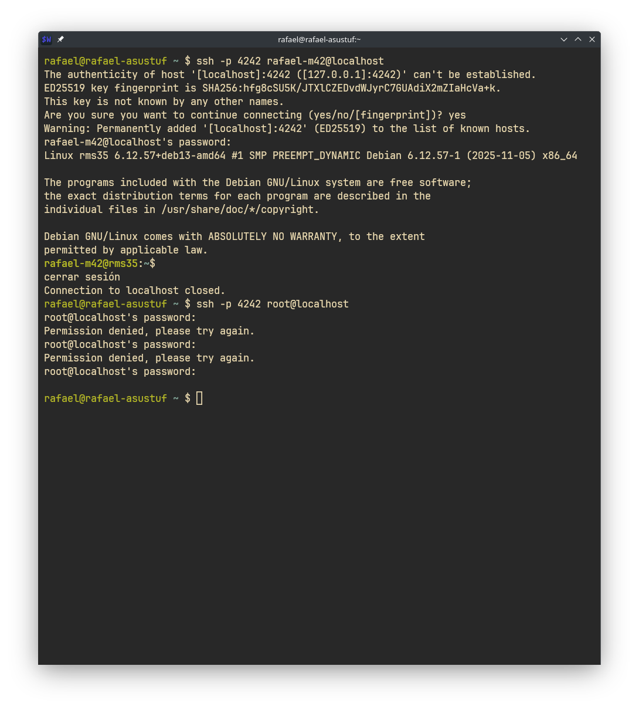

# Born2BeRoot 🛡️

## 📝 Project Overview
Born2BeRoot is a System Administration project that involves setting up a **Virtual Machine (VM)** specifically configured to adhere to strict security policies. The goal is to implement a secure server environment using **Debian (or CentOS)**, managing partitions, users, permissions, and automated monitoring.

## 🏗️ Architecture & Setup
- **Hypervisor:** VirtualBox / UTM
- **OS:** Debian Stable (CLI only, no graphical interface)
- **LVM (Logical Volume Manager):**
  - Encrypted partitions using LVM.
  - Standard partition scheme: `/`, `/home`, `/var`, `/srv`, `/tmp`, `/var/log`.

## 🔐 Security Features

### 1. SSH Configuration
- **Port:** 4242 (Custom port to reduce scanner noise).
- **Root Login:** Disabled (`PermitRootLogin no`).
- **Authentication:** SSH Key-based authentication preferred; Password authentication secured.

### 2. Firewall (UFW)
- Only essential ports are open:
  - **4242:** SSH
  - **80/443:** HTTP/HTTPS (if web services are running)

### 3. Password Policy
Enforced via `libpam-pwquality`:
- Minimum length: 10 characters.
- Complexity: Must contain uppercase, lowercase, and numbers.
- Max consecutive same characters: 3.
- Users are prompted to change passwords every 30 days.

### 4. Sudo Policy
- **Logging:** All sudo actions are logged to `/var/log/sudo/`.
- **Privileges:** Restricted to specific users in the `sudo` group.
- **Security:** TTY required; 3 bad attempts limit.

### 5. Fail2Ban
- Protects SSH against brute-force attacks.
- **Max Retries:** 5 attempts.
- **Ban Time:** 10 minutes.

## 📊 Automated Monitoring
A custom Bash script (`src/scripts/monitoring.sh`) runs every 10 minutes (via Cron) to broadcast system health to all logged-in terminals.

**Metrics Monitored:**
- **Architecture:** OS and Kernel version.
- **CPU:** Physical/Virtual cores and current load.
- **RAM & Disk:** Usage statistics and percentages.
- **LVM:** Active status check.
- **Network:** IP and MAC addresses, active TCP connections.
- **Sudo:** Count of sudo commands executed.

### Script Preview
```bash
# Snippet from src/scripts/monitoring.sh
# Calculates memory usage
ram_total=$(free -m | awk '$1 == "Mem:" {print $2}')
ram_use=$(free -m | awk '$1 == "Mem:" {print $3}')
ram_percent=$(free | awk '$1 == "Mem:" {printf("%.2f"), $3/$2*100}')
```

## 📸 Visual Proofs

| Feature | Screenshot |
|---------|------------|
| **LVM Partitions** |  |
| **Password Policy** |  |
| **SSH Login** |  |
| **UFW Status** |  |
| **Fail2Ban Status** |  |
| **Monitoring Output** |  |
| **Crontab Scheduling** |  |

## 🚀 Usage
To verify the monitoring script manually:
```bash
sudo /usr/local/bin/monitoring.sh
```